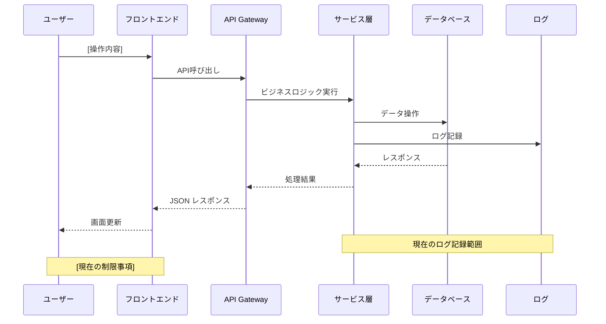

# Current Implementation Analysis

Analyze current implementation for: $ARGUMENTS

## Step 1: Pre-check Requirements Approval

1. Read `spec.json` and verify `"product_request": true`
2. If not approved, inform user to complete product requirements phase first
3. Read `product-req.md` to understand the requirements and value hypotheses

## Step 2: Identify Target Systems

Based on the feature name and requirements, identify relevant systems:
- xxx: `code/xxx`

## Step 3: Search and Analyze Implementation

### 3.1 Search for existing implementations
Use Grep and Glob to search for:
- Related API endpoints
- Database schemas
- Existing logging mechanisms
- Permission/authorization logic
- Audit trail implementations

### 3.2 Code Analysis Priority
1. **API Layer**: Check controller/handler files
2. **Service Layer**: Check business logic implementation
3. **Repository Layer**: Check database operations
4. **Model/Schema**: Check data structures
5. **Middleware**: Check authentication/authorization
6. **Frontend**: Check UI implementation if needed

## Step 4: Generate Current State Document

Create `.product-spec/specs/{feature-name}/current-analysis.md`:

```markdown
# 現状実装調査レポート

---

## 1. 価値仮説との対応

### 調査対象の価値仮説
[product-req.mdから価値仮説を引用]

### 現状実装の概要
| システム名 | 実装状況 | 関連する価値仮説 | 備考 |
|-----------|---------|------------------|------|
| [システム名] | 実装あり/なし/一部 | [価値仮説1,2...] | [補足情報] |

---

## 2. 現状のユーザー体験

### 2.1 {プロダクト名}
#### 現在のユーザー体験
- **機能概要**: [ユーザーが現在できること]
- **操作フロー**: [現在の画面遷移や操作手順]
- **実装箇所**: `[ファイルパス:行番号]`
- **制限事項**: [現在の制限や課題]
- **関連テーブル**: [関連するテーブル情報]
| テーブル名 | 用途 | 主要カラム | 実装箇所 | snowflakeのテーブル名 |
|-----------|------|-----------|---------|---------|
| [テーブル名] | [用途説明] | [カラムリスト] | [スキーマファイル] | [schemaディレクトリから検索したsnowflakeでのテーブル名] |

### 主要テーブルのER図
```mermaid
erDiagram
    [テーブル1] {
        id bigint PK
        [カラム名] [データ型]
        created_at timestamp
    }

    [テーブル2] {
        id bigint PK
        [外部キー] bigint FK
        [カラム名] [データ型]
    }

    [テーブル1] ||--o{ [テーブル2] : "relates to"
```
- **現在の処理フロー**: [システム処理のシーケンス図]


### 2.2 [他の関連システム]
[同様の形式で記載]

---

## 3. ギャップ分析

### 価値仮説vs現状実装
| 価値仮説 | 現状の実装・体験 | ギャップ | 影響度 |
|---------|----------------|---------|--------|
| [価値仮説1] | [現状] | [不足している点] | 高/中/低 |
| [価値仮説2] | [現状] | [不足している点] | 高/中/低 |

---

**STATUS**: 調査完了
**NEXT**: 競合調査を実行する場合は `/spec-competitor-research {feature-name}` を実行
```

## Step 5: Update Status

Update `spec.json`:
```json
{
  "feature": "{feature-name}",
  "created_at": "{timestamp}",
  "updated_at": "{timestamp}",
  "status": "current_analysis_completed",
  "approvals": {
    "product_request": true,
    "current_analysis": false
  },
  "files": {
    "raw_request": "raw-request.txt",
    "product_request": "product-req.md",
    "current_analysis": "current-analysis.md"
  }
}
```

## Step 6: Provide Summary

```
✅ 現状実装調査を完了しました！

📊 調査結果サマリー:
- 調査システム数: [数]
- 既存実装: [あり/なし/一部]
- 主要ギャップ: [概要]

📁 生成ファイル:
- current-analysis.md: 現状実装調査レポート

📝 次のアクション:
1. current-analysis.mdをレビューしてください
2. 技術チームと実装可能性を検討してください
3. 競合調査を実行: `/spec-competitor-research {feature-name}`
```

## Instructions
1. Verify product requirements are approved
2. Search codebase systematically
3. Focus on actual implementation, not just file existence
4. Identify gaps between requirements and current implementation
5. Provide concrete code examples and file references
6. Suggest practical implementation approaches based on existing patterns
