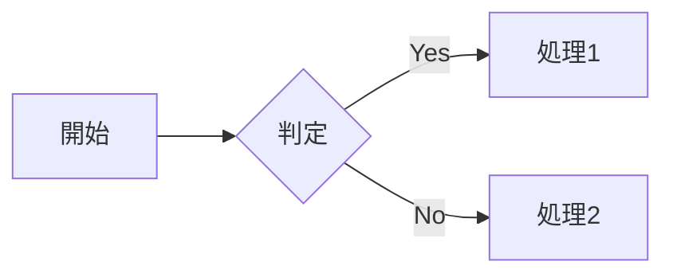
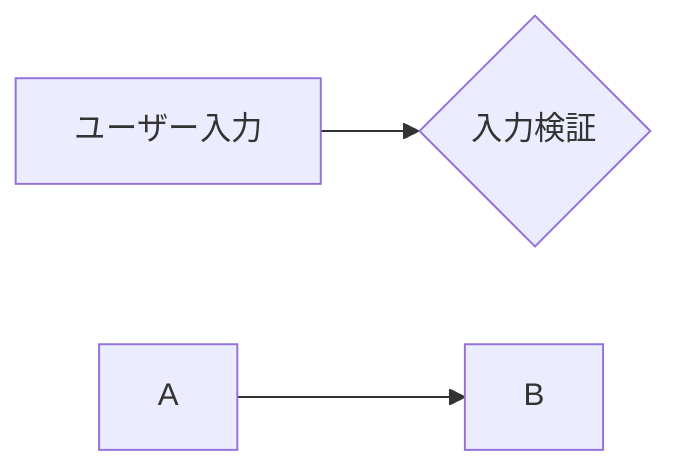
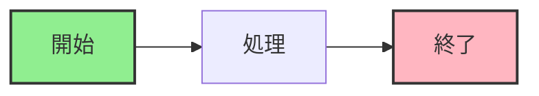
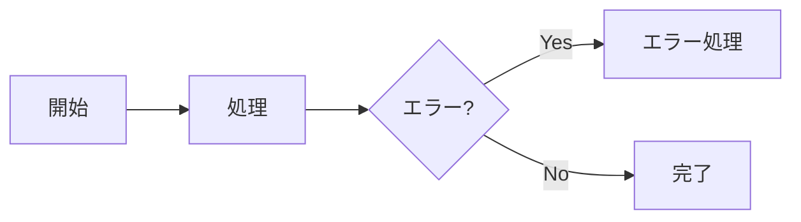
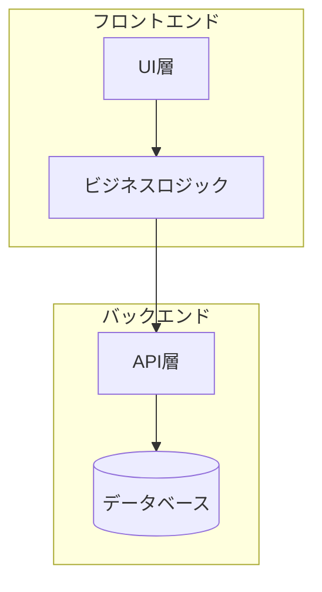
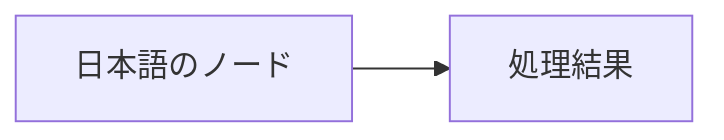
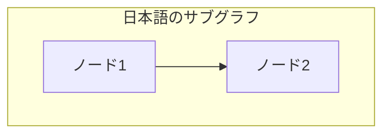
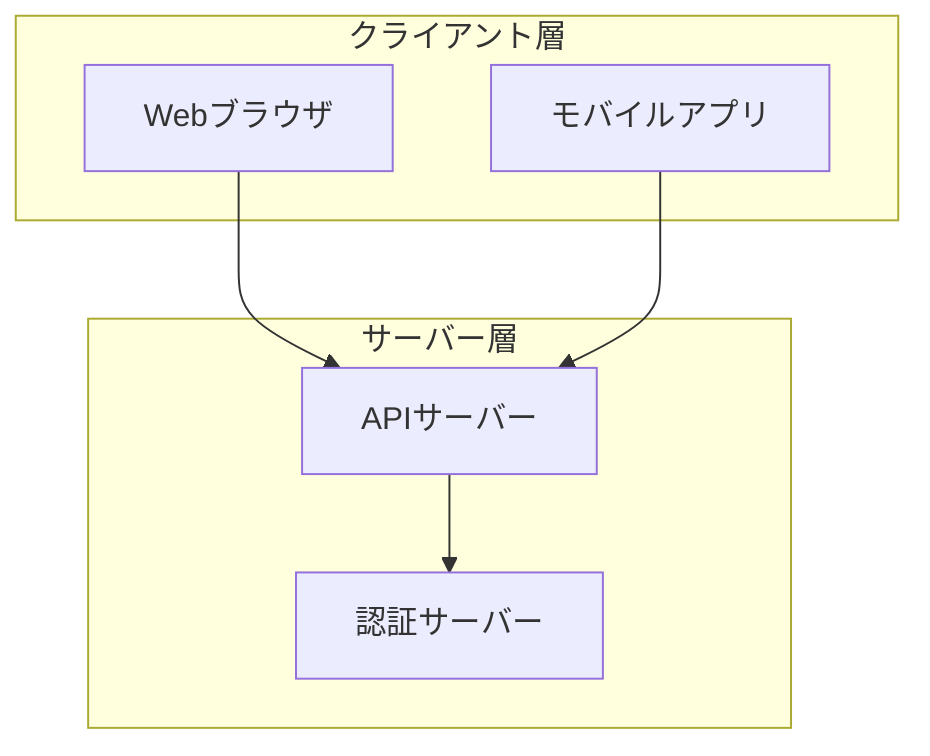

# CLAUDE.md

This file provides guidance to Claude Code (claude.ai/code) when working with code in this repository.

## Project Overview

This is a Product Manager (PdM) repository for commune, containing documentation and tools for product management activities. The repository is primarily in Japanese and serves as a knowledge base for product managers.

## Repository Structure

This is a lightweight documentation repository with:
- `README.md` - Main documentation file containing usage instructions and guides
- Git submodules for referencing actual code implementations (when needed)

## Key Features

### Submodule Management

The repository uses git submodules to reference actual code for AI PdM tools to analyze existing implementations and suggest analytical queries.

To update submodules:
```bash
./scripts/update-repo.sh
```

Note: The `scripts/` directory and submodules may not be present in all clones. They are optional for non-engineering users.

## Development Notes

- This is primarily a documentation repository for product managers
- No build system, package manager, or test framework is currently configured
- Content is maintained in Markdown format
- The repository may contain references to AI PdM tools (currently under development)

## Working with This Repository

When making changes:
1. Focus on documentation clarity and completeness
2. Maintain the Japanese language where already used
3. Keep markdown formatting consistent with existing content
4. If adding code examples, use TypeScript as shown in the README

## Important Context

- Target audience: Product managers at commune
- Language: Primarily Japanese
- Purpose: Documentation, specifications, and AI-assisted product management tools

# Mermaid-diagram Rules

---
description: Mermaidダイアグラムを使用してドキュメントに図表を追加する際のベストプラクティスとガイドライン
globs:
  - "**/*.md"
  - "**/*.mdx"
  - "**/README*"
  - "**/docs/**"
alwaysApply: false
---

# Mermaidダイアグラム作成ガイド

## 概要

Mermaidは、テキストベースでダイアグラムを作成できるツールです。コードとして図表を管理できるため、バージョン管理が容易で、ドキュメントの保守性が向上します。

## 基本的な使用方法

Markdownファイル内でMermaidダイアグラムを使用する場合は、以下のようにコードブロックで囲みます：

````markdown

````

## 推奨されるダイアグラムタイプの選択

### 1. フローチャート (`flowchart`)
- **用途**: プロセスフロー、ワークフロー、アルゴリズムの表現
- **選択基準**: 処理の流れや分岐を示したい場合

### 2. シーケンス図 (`sequenceDiagram`)
- **用途**: オブジェクト間の相互作用、API通信フロー
- **選択基準**: 時系列での処理の流れを示したい場合

### 3. クラス図 (`classDiagram`)
- **用途**: オブジェクト指向設計、データ構造の表現
- **選択基準**: クラスの関係性や構造を示したい場合

### 4. 状態遷移図 (`stateDiagram-v2`)
- **用途**: システムの状態管理、ライフサイクルの表現
- **選択基準**: 状態の変化とトリガーを示したい場合

### 5. ER図 (`erDiagram`)
- **用途**: データベース設計、エンティティ間の関係
- **選択基準**: データモデルを可視化したい場合

### 6. ガントチャート (`gantt`)
- **用途**: プロジェクトスケジュール、タスク管理
- **選択基準**: 時間軸に沿ったタスクの進行を示したい場合

## 記述のベストプラクティス

### 1. 分かりやすい命名


### 2. 適切な方向の選択
- `TB`/`TD`: 上から下（縦型レイアウト）
- `LR`: 左から右（横型レイアウト）
- `RL`: 右から左
- `BT`: 下から上

### 3. スタイリングの活用


### 4. コメントの活用


## パフォーマンスの考慮

### 1. 図の複雑さを管理
- 1つの図に含めるノード数は20-30個程度に抑える
- 複雑な図は複数の図に分割する

### 2. サブグラフの活用


## 日本語使用時の注意点

### 1. ダブルクォートで囲む（重要）
**日本語を含むテキストは必ずダブルクォート（`"`）で囲む必要があります。**
囲まないとMermaidのパースエラーが発生し、図が正しくレンダリングされません。





### 2. フォントの考慮
- 日本語を含む場合は、ブラウザのデフォルトフォントに依存
- 必要に応じてCSSでフォントを指定

### 3. テキストの長さ
- ノード内のテキストは簡潔に
- 長い説明は図の外に記載

### 4. エンコーディング
- UTF-8を使用してファイルを保存

## ドキュメント統合のガイドライン

### 1. 図の配置
- 関連するテキストの近くに配置
- 図の前後に説明文を追加

### 2. 図のタイトル
```markdown
### システムアーキテクチャ図



上図は、システム全体のアーキテクチャを示しています。
```

### 3. 参照可能な図の作成
- 図には一意の識別子を付ける
- 必要に応じて図番号を付ける

## Mermaidシンタックスリファレンス

詳細なシンタックスについては、以下のドキュメントを参照してください：

- `/docs/mermaid/README.md` - Mermaidダイアグラム一覧とクイックリファレンス
- `/docs/mermaid/syntax/` - 各ダイアグラムタイプの詳細なシンタックスガイド

## トラブルシューティング

### 1. レンダリングエラー
- シンタックスエラーを確認（括弧の対応、矢印の記述）
- 特殊文字のエスケープ（`"`, `'`, `<`, `>`）

### 2. 日本語が表示されない
- ファイルのエンコーディングを確認
- Mermaidのバージョンを確認

### 3. 図が大きすぎる
- ノード数を減らす
- サブグラフで整理する
- 複数の図に分割する

## 実装時の推奨事項

1. **新しいドキュメントを作成する際**：
   - 適切なダイアグラムタイプを選択
   - シンプルで理解しやすい図から始める

2. **既存のドキュメントを更新する際**：
   - 図の一貫性を保つ
   - 既存のスタイルに合わせる

3. **レビュー時の確認事項**：
   - 図が意図を正確に伝えているか
   - 不要な複雑さがないか
   - アクセシビリティが考慮されているか
