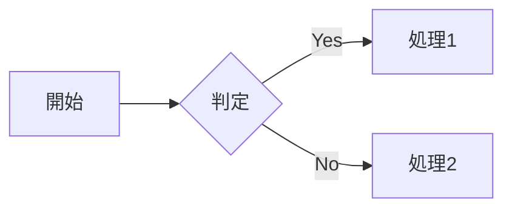

# Mermaid ダイアグラム シンタックスガイド

このディレクトリには、Mermaidで利用可能な各種ダイアグラムタイプのシンタックスガイドが含まれています。

## 📊 ダイアグラムタイプ一覧

### 基本的なダイアグラム

- **[フローチャート (Flowchart)](syntax/flowchart.md)** - ワークフローやプロセスを表現
- **[シーケンス図 (Sequence Diagram)](syntax/sequenceDiagram.md)** - オブジェクト間の相互作用を時系列で表現
- **[クラス図 (Class Diagram)](syntax/classDiagram.md)** - オブジェクト指向設計のクラス構造を表現
- **[ER図 (Entity Relationship Diagram)](syntax/entityRelationshipDiagram.md)** - データベース設計のエンティティ関係を表現
- **[状態遷移図 (State Diagram)](syntax/stateDiagram.md)** - システムの状態とその遷移を表現

### プロジェクト管理

- **[ガントチャート (Gantt Chart)](syntax/gantt.md)** - プロジェクトのスケジュールとタスクを表現
- **[カンバンボード (Kanban Board)](syntax/kanban.md)** - タスクの進捗状況を視覚的に管理
- **[要求図 (Requirement Diagram)](syntax/requirementDiagram.md)** - 要求とその関係を表現
- **[ユーザージャーニー (User Journey)](syntax/userJourney.md)** - ユーザー体験の流れを表現

### データビジュアライゼーション

- **[円グラフ (Pie Chart)](syntax/pie.md)** - データの割合を円形で表現
- **[XYチャート (XY Chart)](syntax/xyChart.md)** - 2次元のデータプロット
- **[レーダーチャート (Radar Chart)](syntax/radar.md)** - 複数の軸でデータを比較
- **[象限チャート (Quadrant Chart)](syntax/quadrantChart.md)** - 2つの軸でデータを4象限に分類
- **[サンキー図 (Sankey Diagram)](syntax/sankey.md)** - フローの量的関係を表現
- **[ツリーマップ (Treemap)](syntax/treemap.md)** - 階層的データを面積で表現

### アーキテクチャ・システム設計

- **[アーキテクチャ図 (Architecture Diagram)](syntax/architecture.md)** - クラウドやCI/CDのサービス関係を表現
- **[C4図 (C4 Diagram)](syntax/c4.md)** - ソフトウェアアーキテクチャの4レベル表現
- **[ブロック図 (Block Diagram)](syntax/block.md)** - システムのブロック構成を表現
- **[パケット図 (Packet Diagram)](syntax/packet.md)** - ネットワークパケットの構造を表現

### その他の特殊なダイアグラム

- **[Git グラフ (Git Graph)](syntax/gitgraph.md)** - Gitのブランチとコミット履歴を表現
- **[タイムライン (Timeline)](syntax/timeline.md)** - イベントの時系列を表現
- **[マインドマップ (Mindmap)](syntax/mindmap.md)** - アイデアの階層構造を表現
- **[ZenUML](syntax/zenuml.md)** - より表現力豊かなシーケンス図

## 🎯 使い方

1. 作成したいダイアグラムタイプを上記のリストから選択
2. 各ガイドページでシンタックスと例を確認
3. コードブロックに `mermaid` 言語を指定してダイアグラムを記述

### 基本的な記述例

````markdown

````

## 📚 参考リソース

- [Mermaid公式ドキュメント](https://mermaid.js.org/)
- [Mermaid Live Editor](https://mermaid.live/) - オンラインでMermaidダイアグラムを試せるエディタ
- [Mermaid Examples](syntax/examples.md) - 各種ダイアグラムの実例集
