# Mermaid 使い方ガイド for PdM

このドキュメントは、`commune-pdm` リポジトリでMermaidを利用して図を作成する方法を、初めての方にも分かりやすく解説します。

## 1. Mermaidとは？

Mermaidは、テキストベースで簡単にフローチャートやシーケンス図などのダイアグラムを作成できるツールです。コードのようにバージョン管理ができるため、ドキュメントのメンテナンス性が向上します。

## 2. 基本的な書き方とルール

当リポジトリでは、Mermaidの利用に関する基本的なガイドラインを `CLAUDE.md` に`# Mermaid-diagram Rules`として定義しています。まずはこのルールに目を通し、基本的な書き方やベストプラクティスを把握してください。

> **[IMPORTANT]**
> 特に、**日本語をノード名などに使用する場合は、必ずダブルクォート `"` で囲んでください。** これを守らないと、図が正しく表示されません。
>
> ```mermaid
> flowchart LR
>     A["これが正しい日本語の書き方"] --> B["こちらもOK"]
> ```

基本的な書き方は、Markdownファイル内に ` ```mermaid ` で始まるコードブロックを作成し、その中にMermaidの記法で図の内容を記述します。

````markdown
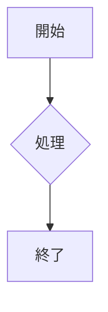
````

## 3. 主要なダイアグラムの書き方とサンプル

ここでは、`docs/mermaid/syntax/` にあるドキュメントの中から、特によく利用されるダイアグラムをピックアップし、`commune-pdm` プロジェクトに馴染みのある例を交えて紹介します。

### 3.1. フローチャート (`flowchart`)

**用途:** プロセスの流れやワークフローを視覚化するのに最適です。

**例: 承認フロー**

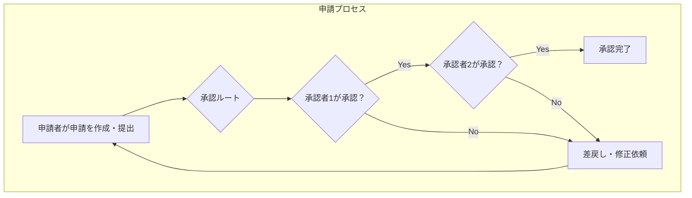

<details>
<summary>フローチャートのより詳しい書き方</summary>

ノードの形を変えたり、矢印の種類を変えたり、サブグラフを使ってグループ化するなど、多彩な表現が可能です。詳細は [`docs/mermaid/syntax/flowchart.md`](./docs/mermaid/syntax/flowchart.md) を参照してください。
</details>

### 3.2. シーケンス図 (`sequenceDiagram`)

**用途:** オブジェクトやサービス間のメッセージのやり取りを時系列で表現します。APIの通信フローなどを記述するのに便利です。

**例: APIの通信シーケンス**

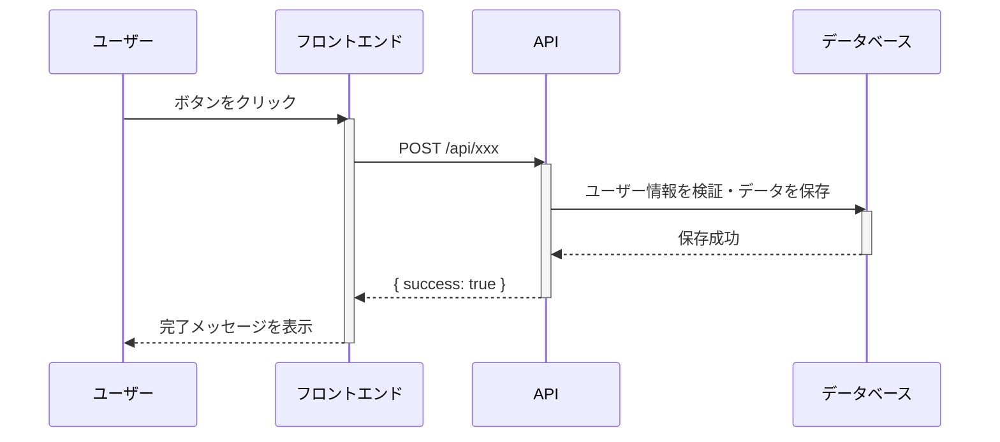
<details>
<summary>シーケンス図のより詳しい書き方</summary>

参加者の活性化/非活性化、ループ、条件分岐なども表現できます。詳細は [`docs/mermaid/syntax/sequenceDiagram.md`](./docs/mermaid/syntax/sequenceDiagram.md) を参照してください。
</details>

### 3.3. 状態遷移図 (`stateDiagram-v2`)

**用途:** オブジェクトやシステムが取りうる「状態」と、イベントによってどのように状態が変化するかを表現します。

**例: ドキュメントのステータス遷移**

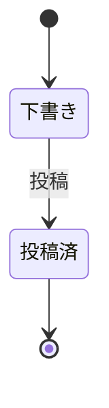

<details>
<summary>状態遷移図のより詳しい書き方</summary>

複合状態や並行状態など、複雑なライフサイクルもモデリング可能です。詳細は [`docs/mermaid/syntax/stateDiagram.md`](./docs/mermaid/syntax/stateDiagram.md) を参照してください。
</details>

### 3.4. ER図 (`entityRelationshipDiagram`)

**用途:** データベースのエンティティ（テーブル）と、それらの間の関連（リレーション）を表現します。

**例: ユーザーとチームのER図**

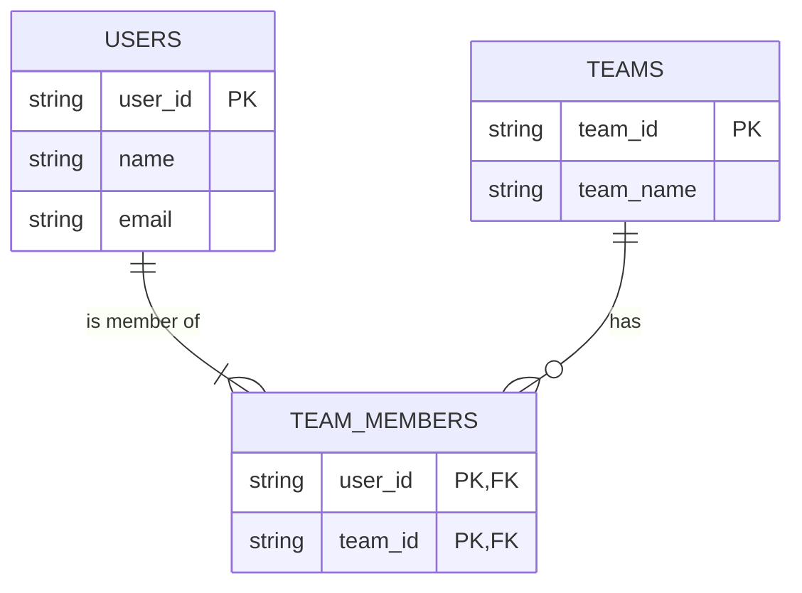

<details>
<summary>ER図のより詳しい書き方</summary>

カーディナリティ（多重度）や主キー(PK)、外部キー(FK)なども明示できます。詳細は [`docs/mermaid/syntax/entityRelationshipDiagram.md`](./docs/mermaid/syntax/entityRelationshipDiagram.md) を参照してください。
</details>

### 3.5. ガントチャート (`gantt`)

**用途:** プロジェクトのスケジュールやタスクの進捗を視覚的に管理します。

**例: 新機能開発のスケジュール**

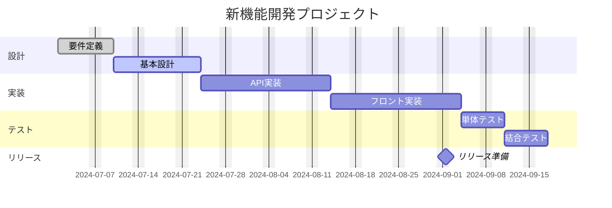

<details>
<summary>ガントチャートのより詳しい書き方</summary>

タスクの状態（完了、アクティブなど）やマイルストーンを設定できます。詳細は [`docs/mermaid/syntax/gantt.md`](./docs/mermaid/syntax/gantt.md) を参照してください。
</details>

### 3.6. 円グラフ (Pie Chart)

**用途:** 全体に対する各要素の割合を示すのに適しています。アンケート結果や費目の内訳などを表現するのに便利です。

**例: 各サービス利用企業の割合**

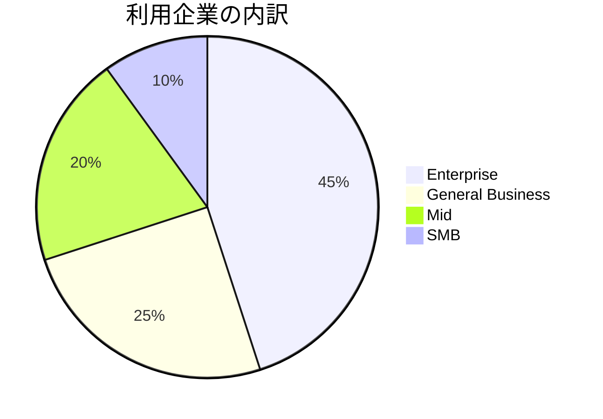

<details>
<summary>円グラフのより詳しい書き方</summary>

`showData` を追加すると、グラフに実際の数値を表示できます。詳細は [`docs/mermaid/syntax/pie.md`](./docs/mermaid/syntax/pie.md) を参照してください。
</details>

### 3.7. 四象限図 (Quadrant Chart)

**用途:** 2つの軸（例えば「重要度」と「緊急度」）でデータを4つの領域に分類し、分析や意思決定に役立てます。

**例: 機能改善の優先度マトリクス**

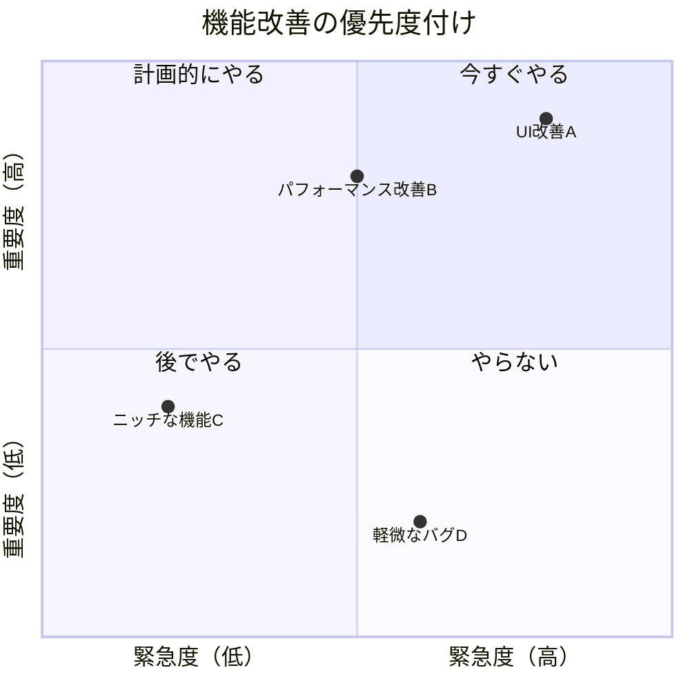
<details>
<summary>四象限図のより詳しい書き方</summary>

各象限のテキストや軸のラベルは自由に設定できます。詳細は [`docs/mermaid/syntax/quadrantChart.md`](./docs/mermaid/syntax/quadrantChart.md) を参照してください。
</details>

### 3.8. タイムライン図 (Timeline)

**用途:** イベントの発生順序を時系列で表現します。プロジェクトの歴史やリリース履歴などを表すのに便利です。

**例: communeのリリース履歴**

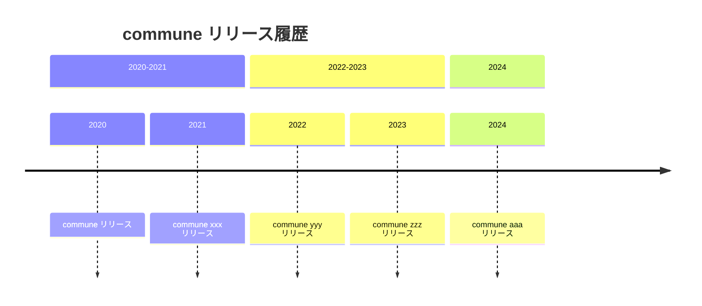
<details>
<summary>タイムライン図のより詳しい書き方</summary>

`<br>` を使ってイベント内で改行することも可能です。詳細は [`docs/mermaid/syntax/timeline.md`](./docs/mermaid/syntax/timeline.md) を参照してください。
</details>

### 3.9. ユーザージャーニー図 (User Journey)

**用途:** ユーザーが特定の目的を達成するまでのステップと、その時の感情や体験を可視化します。UX改善に繋がる課題発見に役立ちます。

**例: 経費精算のユーザージャーニー**

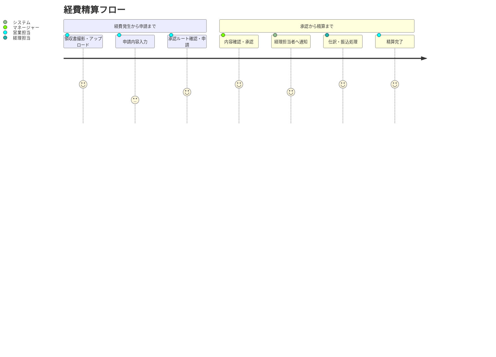
<details>
<summary>ユーザージャーニー図のより詳しい書き方</summary>

各ステップにスコア（満足度など）と担当者を記述します。詳細は [`docs/mermaid/syntax/userJourney.md`](./docs/mermaid/syntax/userJourney.md) を参照してください。
</details>

### 3.10. サンキー図 (Sankey Diagram)

**用途:** ある地点から別の地点への「流れ」や「量」を可視化します。ユーザーのページ遷移や、エネルギー・コストの流れなどを表現するのに適しています。

**例: Webサイトのユーザートラフィック分析**
> **[注意]**
> `sankey-beta` は現在、日本語のノード名に対応していません。ノード名には英数字を使用してください。

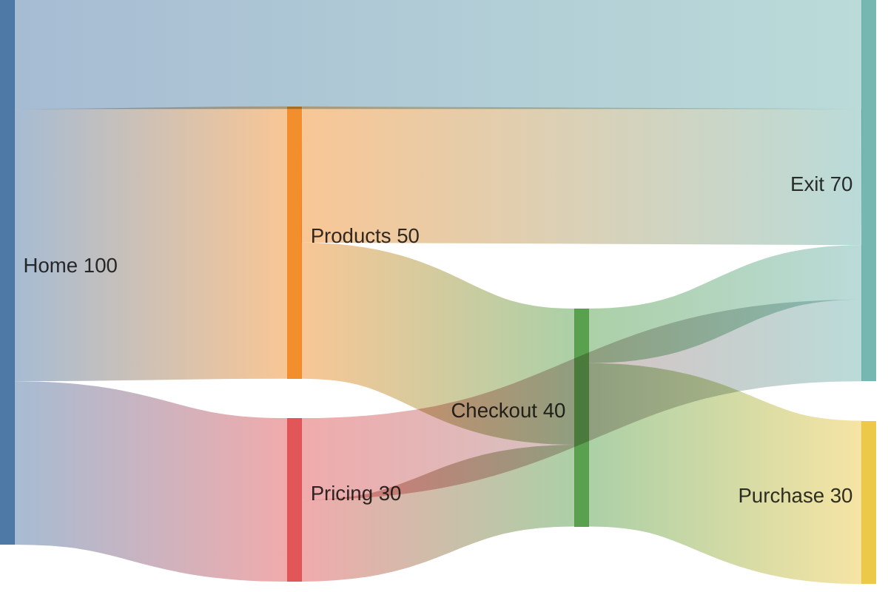
<details>
<summary>サンキー図のより詳しい書き方</summary>
`ソース,ターゲット,値` のCSV形式でデータを定義します。詳細は [`docs/mermaid/syntax/sankey.md`](./docs/mermaid/syntax/sankey.md) を参照してください。
</details>

### 3.11. マインドマップ (Mindmap)

**用途:** 中心となるテーマから、関連するアイデアや情報を放射状に広げて整理します。ブレインストーミングや思考の整理に適しています。

**例: 新規事業のアイデア出し**
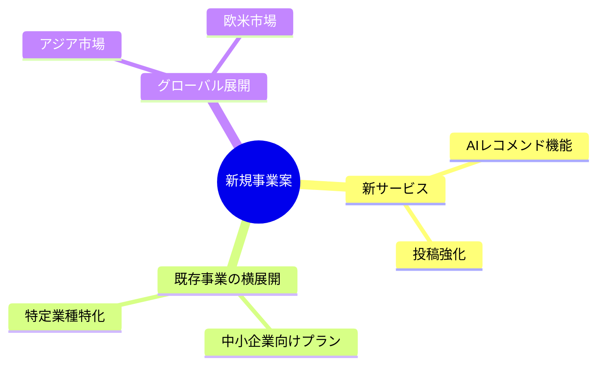
<details>
<summary>マインドマップのより詳しい書き方</summary>
インデント（字下げ）を使って階層を表現します。ノードの形も変更可能です。詳細は [`docs/mermaid/syntax/mindmap.md`](./docs/mermaid/syntax/mindmap.md) を参照してください。
</details>

### 3.12. カンバン図 (Kanban)

**用途:** タスクのステータス（例：未着手、作業中、完了）を可視化し、チームの進捗管理を円滑にします。

**例: 開発チームのタスク管理**
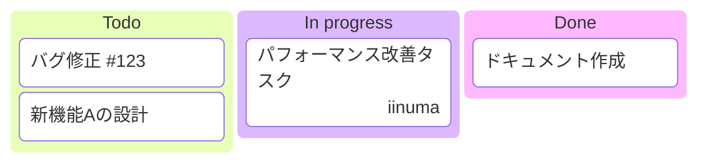
<details>
<summary>カンバン図のより詳しい書き方</summary>
列を定義し、その下にタスクを配置します。担当者などのメタデータも追加可能です。詳細は [`docs/mermaid/syntax/kanban.md`](./docs/mermaid/syntax/kanban.md) を参照してください。
</details>

### 3.13. ブロック図 (Block Diagram)

**用途:** システムの構成要素を高レベルで抽象的に表現します。複雑なアーキテクチャをシンプルに伝えたい場合に有効です。

**例: システム概要**
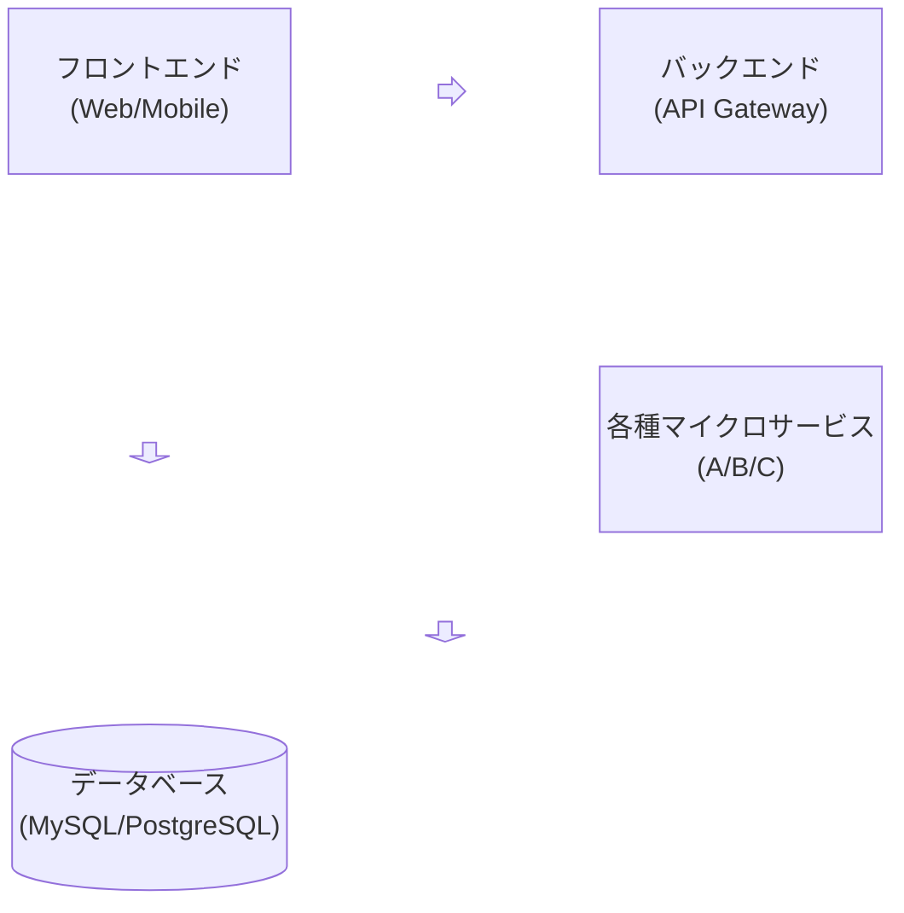
<details>
<summary>ブロック図のより詳しい書き方</summary>
ブロックを配置し,矢印で接続します。`columns`でレイアウトを調整できます。詳細は [`docs/mermaid/syntax/block.md`](./docs/mermaid/syntax/block.md) を参照してください。
</details>

## 4. さらに詳しく知るには

このドキュメントでは代表的な図を紹介しましたが、Mermaidでは他にも様々なダイアグラムを描画できます。
全種類のシンタックスについては、以下のディレクトリを参照してください。

- [`docs/mermaid/syntax/`](./docs/mermaid/syntax/)
