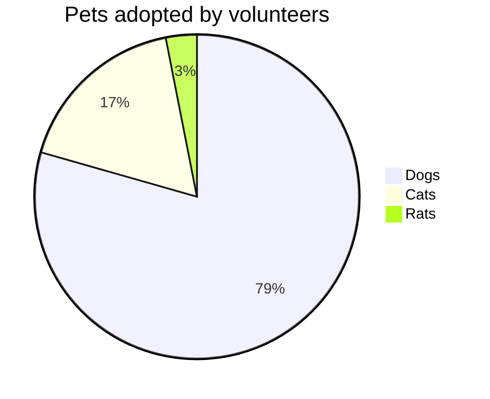
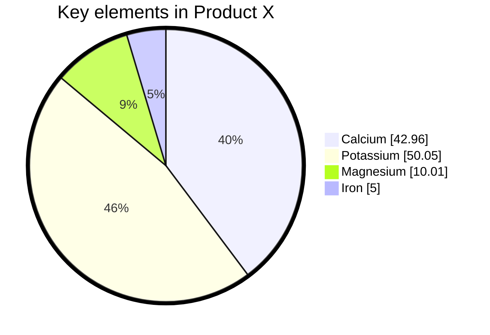

> **Warning**
>
> ## THIS IS AN AUTOGENERATED FILE. DO NOT EDIT.
>
> ## Please edit the corresponding file in [/packages/mermaid/src/docs/syntax/pie.md](../../packages/mermaid/src/docs/syntax/pie.md).

# 円グラフ (Pie Chart)

円グラフは、全体に対する各部分の割合を扇形で表現する統計図表です。データの構成比や割合を視覚的に分かりやすく表示でき、各要素の相対的な大きさを直感的に理解することができます。

## 主な用途

- データの構成比の可視化
- 市場シェアの表示
- 予算配分の表現
- アンケート結果の集計表示
- カテゴリ別の割合比較

# Pie chart diagrams

> A pie chart (or a circle chart) is a circular statistical graphic, which is divided into slices to illustrate numerical proportion. In a pie chart, the arc length of each slice (and consequently its central angle and area), is proportional to the quantity it represents. While it is named for its resemblance to a pie which has been sliced, there are variations on the way it can be presented. The earliest known pie chart is generally credited to William Playfair's Statistical Breviary of 1801
> -Wikipedia

Mermaid can render Pie Chart diagrams.

## Syntax

Drawing a pie chart is really simple in mermaid.

- Start with `pie` keyword to begin the diagram
  - `showData` to render the actual data values after the legend text. This is **_OPTIONAL_**
- Followed by `title` keyword and its value in string to give a title to the pie-chart. This is **_OPTIONAL_**
- Followed by dataSet. Pie slices will be ordered clockwise in the same order as the labels.
  - `label` for a section in the pie diagram within `" "` quotes.
  - Followed by `:` colon as separator
  - Followed by `positive numeric value` (supported up to two decimal places)

\[pie] \[showData] (OPTIONAL)
\[title] \[titlevalue] (OPTIONAL)
"\[datakey1]" : \[dataValue1]
"\[datakey2]" : \[dataValue2]
"\[datakey3]" : \[dataValue3]
.
.

## Example

## Configuration

Possible pie diagram configuration parameters:

| Parameter      | Description                                                                                                  | Default value |
| -------------- | ------------------------------------------------------------------------------------------------------------ | ------------- |
| `textPosition` | The axial position of the pie slice labels, from 0.0 at the center to 1.0 at the outside edge of the circle. | `0.75`        |
